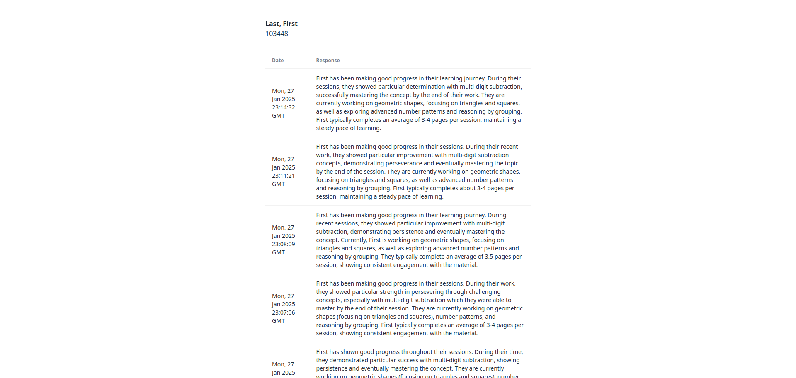
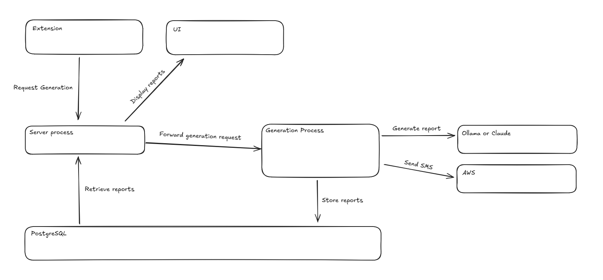

# GradeForge

GradeForge converts student data into personalized report cards automatically.

- Generates report cards with your choice of LLM1
- Provides a dashboard of previously made reports
- Updates you through text when generation has completed
- Can be managed with a single command2

This is a reimplementation of the first report card generator I made in late 2023 for my work at the time. The extension contains code used to scrape the company's admin pages, and I have made that code private due to the potential risk of exposing sensitive details inadvertently.

1 - It comes packaged with the choice of Anthropic Claude's API or an Ollama model, but the [`TextGen`](../server/src/text_gen.py) interface can easily be extended to add more.

2 - Other features and options can be configured directly with its [environment variables](../example.env).

## Usage
After completing [setup](#setup), the service's main generation endpoint `/generate` will be ready to accept data. The data is expected to be a binary string encoded by its [protocal buffer object](../proto/student_details.proto).

This will kick off the generation, executing the following 3 steps sequentially: 
1. use an LLM to generate the report content
2. store the result in the database
3. send a SMS notifying its completion

 You can then use the dashboard to see all the reports you've generated.

For detailed example data, check [here](example.md).

## How it works
GradeForge coordinates a number of different services to achieve its goal.

### Architecture

The backend is a pair of Python processes and a PostgreSQL instance. The processes are split so that one process can handle incoming generation and data requests. The process handles the data requests and forwards the generation requests to the second process. The second actually carries out the generation itself. The result is stored in the database, which can be written to and read from on both processes.

Report card text generation can take an indeterminate amount of time, so handling requests this way allows the server to not block or accumulate unresolved futures.

The frontend is a dead simple Next.js application.

### Generation request processing

The generation process starts by using an LLM to generate the text content of the report card. Depending on the options that the application was run with, the process will either query an [Ollama](https://ollama.com/) model (defaulting to the [llama3.2 model](https://ollama.com/library/llama3.2)) or Anthropic's [Claude 3.5 Sonnet](https://www.anthropic.com/claude/sonnet), storing it in the database after completion. The process then uses [Boto3](https://boto3.amazonaws.com/v1/documentation/api/latest/index.html) to send an SMS to notify of the completed generation.

### Orchastrating

The bash script is included to allow an easy way for less technical users to navigate its options. The script also manages a checksum of your environment variables to verify if the containers should be built again, as Docker Compose won't rebuild containers if build-time environment variables change.

### Extension <=> Server messaging

The serivce uses [protocal buffers](https://protobuf.dev/) to pass around the student details. This allows the objects to be fairly compressed with relatively fast decompression, be strongly-typed, and be easily maintainable.

## Setup
Setup typically only requires making sure you have [Docker Compose](https://docs.docker.com/compose/install/) installed and that the appropriate environment variables are set. For a detailed explanation of the different environment variables that need to be set, look [here](../example.env).

Optionally, if you want to use SMS notifications, [configure an AWS SNS instance](https://docs.aws.amazon.com/sns/latest/dg/sns-mobile-phone-number-as-subscriber.html) with a topic named `gradeforge-updates`. Attached to this topic should be all the phone numbers you want to be notified when a generation request has completed.

## Limitations

* As previously mentioned, the extension code has not been included as it contains specific, closed source implementation details for the propriatery software used at my previous work.

* The setup has been purposefully made to be as easy as possible for people with limited technological skills, although more could be done on this front. For example, there is no automatic provisioning of AWS SNS as the proper creation/setup of this resource requires your organization to go through an approval process with AWS itself (in order to meet regulations about spam prevention).

* Make sure that your use complies with the license.