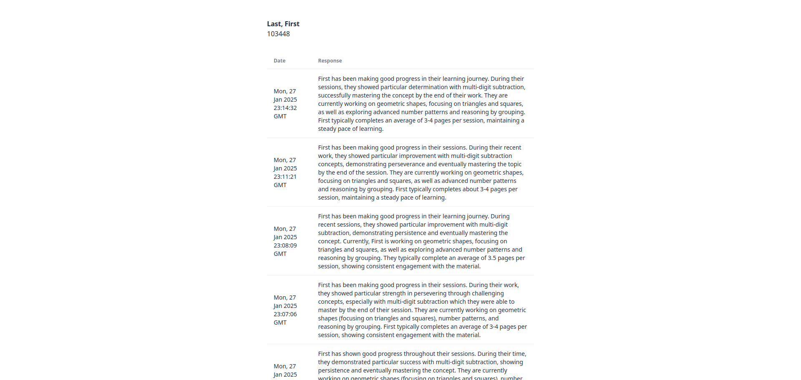

# An example student

A student's report card needs to answer a few different questions,
* How have they behaved during their sessions?
* How productive have they been during their sessions?
* Is there anything they've been struggling on or excelling at?
* What are the current topics they're working on?

When using the [extension](../extension/), this data is all automatically gathered and sent to the generation service. If you are a third-party or are just testing the tool, then you will either have to create a mechanism to gather and send the data or follow the process below.

## Creating the data

First, instantiate a [protobuf object](../proto/student_details.proto) with the details below. This is the data for our example student (the data is not from any real student).
```
student_id: "103448"
student_name: "Last, First"
behavior_comments {
  date {
    seconds: 1484248326
  }
  comment: "Worked well, struggled with multi-digit subtraction but got it by the end of the sesion"
  pages_completed: 4
}
behavior_comments {
  date {
    seconds: 1484248326
  }
  comment: "Was pretty distracted by people around them"
  pages_completed: 3
}
total_plan_length: 12
updated_lessons {
  name: "[PK104] Multidigit subtraction"
  completed: true
}
updated_lessons {
  name: "[PK1055] Geometric shapes: Triangles and Squares"
}
updated_lessons {
  name: "[PK64] Advanced Number patterns"
}
updated_lessons {
  name: "[PK999] Reasoning by grouping"
}
```

This object will be [serialized to a binary string](https://googleapis.dev/python/protobuf/latest/google/protobuf/message.html#google.protobuf.message.Message.SerializeToString), which is then sent as the data for the generation request.

```
'\n\x06103448\x12\x0bLast, First"c\n\x06\x08\x86\xaa\xdf\xc3\x05\x12WWorked well, struggled with multi-digit subtraction but got it by the end of the sesion\x18\x04"7\n\x06\x08\x86\xaa\xdf\xc3\x05\x12+Was pretty distracted by people around them\x18\x03(\x0c2"\n\x1e[PK104] Multidigit subtraction\x10\x0122\n0[PK1055] Geometric shapes: Triangles and Squares2!\n\x1f[PK64] Advanced Number patterns2\x1f\n\x1d[PK999] Reasoning by grouping'
```

## Submitting a generation request

To start the generation, send the data to the server using [cURL](https://curl.se/).

```bash
curl -X POST --data-raw $<your binary string> http://localhost:<your backend port>/generate
```

Filling with our data,

```bash
curl -X POST --data-raw $'\n\x06103448\x12\x0bLast, First"c\n\x06\x08\x86\xaa\xdf\xc3\x05\x12WWorked well, struggled with multi-digit subtraction but got it by the end of the sesion\x18\x04"7\n\x06\x08\x86\xaa\xdf\xc3\x05\x12+Was pretty distracted by people around them\x18\x03(\x0c2"\n\x1e[PK104] Multidigit subtraction\x10\x0122\n0[PK1055] Geometric shapes: Triangles and Squares2!\n\x1f[PK64] Advanced Number patterns2\x1f\n\x1d[PK999] Reasoning by grouping' http://localhost:3000/generate
```

## Viewing the result

The output of the generation should be similar to the following:
```
First has shown good progress in their math work. They demonstrated particularly strong improvement with multi-digit subtraction, mastering the concept by the end of their session. Currently, they are working on geometric shapes, number patterns, and reasoning by grouping. First typically completes 3-4 pages per session.
```

And in the interface, you should see a table with the report that looks like the image below.

